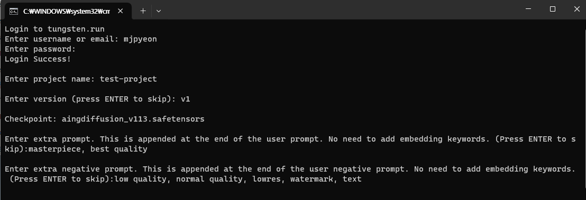
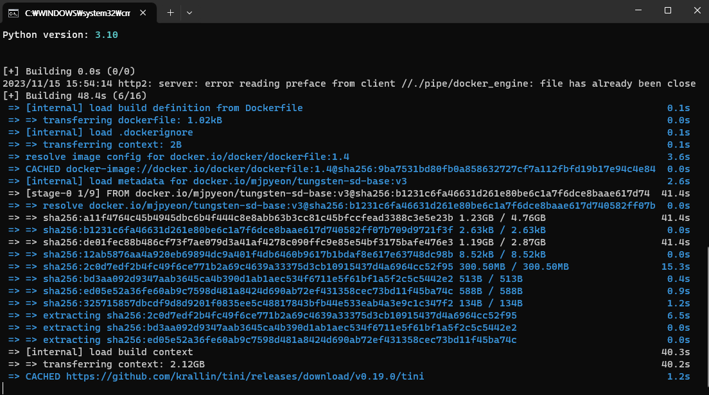
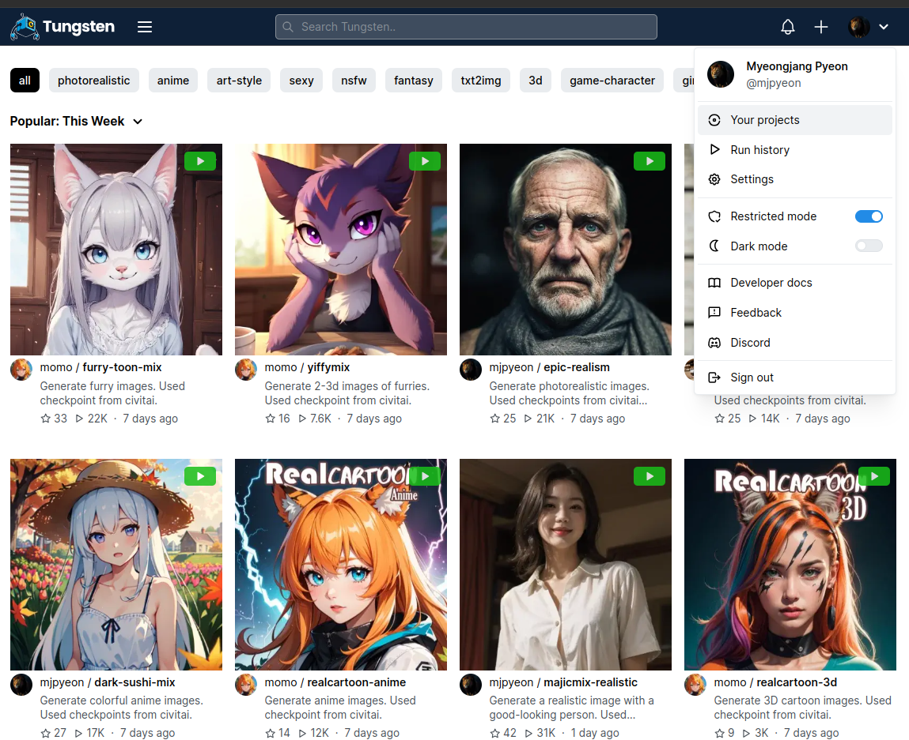

# Tungsten Stable Diffusion Template

Tungsten Stable Diffusion Template is for easily building Tungsten model with Stable Diffusion model weights.

## For Windows
1. Install [Docker Desktop for Windows](https://docs.docker.com/desktop/install/windows-install/)
2. Download `tungsten-sd.zip` and extract its contents  
[Download tungsten-sd.zip](https://github.com/tungsten-ai/tungsten-sd/releases/download/v0.1.0/tungsten-sd.zip){ .md-button }
3. Double-click `update.bat`
4. Put your SD files into following directories
    - 1 Checkpoint: `tungsten-sd/models/Stable-diffusion`
    - LoRAs (optional): `tungsten-sd/models/Lora`
    - embeddings (optional): `tungsten-sd/embeddings`
    - VAEs (optional): `tungsten-sd/models/VAE`
5. Double-click `build_and_push.bat` and enter the responses (e.g. username and password at [tungsten.run](https://tungsten.run)).

6. Wait until building and pushing your model is finished

7. Visit [tungsten.run](https://tungsten.run) and go to Your projects > YOUR_PROJECT_NAME to find the uploaded model.



## For Linux

### Prerequisites

- Stable diffusion weights
- [Python 3.7+](https://www.python.org/downloads/)
- [Docker](https://docs.docker.com/get-docker/)

### Create your Stable Diffusion model in Tungsten
#### 1. Clone this repository
```
git clone --recursive https://github.com/tungsten-ai/tungsten-sd.git
cd tungsten-sd
```

#### 2. Install Tungstenkit

First, install [Tungstenkit](https://github.com/tungsten-ai/tungstenkit):

```bash
pip install tungstenkit
```

#### 3. Prepare weights
Put your Stable Diffusion model weights to ``models/Stable-diffusion``.

If you want to have your own LoRA and VAE, refer to [advanced configuration](#advanced-configuration).

#### 4. Build model

```bash
tungsten build . -n tungsten-stable-diffusion
```

#### 4. Create a project on Tungsten

Go to [tungsten.run](https://tungsten.run/new) and create a project.

#### 5. Push the model to Tungsten

Log in to Tungsten:

```bash
tungsten login
```

Add tag of the model:
```bash
tungsten tag tungsten-stable-diffusion <YOUR_PROJECT_NAME>:<YOUR_MODEL_VERSION>
```

Then, push the model to the project:
```bash
tungsten push <YOUR_PROJECT_NAME>:<YOUR_MODEL_VERSION>
```

#### 6. Run the model on Tungsten

Visit [tungsten.run](https://tungsten.run) and go to the project page.


### Advanced configuration
#### LoRA
1. Put your LoRA model weights to ``models/Lora``.
2. Modify ``StableDiffusion.get_loras`` function in ``tungsten_model.py`` to adjust the lora magnitude.

#### VAE
Put your VAE model weights to ``models/VAE``.

#### Embedding
1. Put your embedding files to ``embeddings``.
2. Customize prompt (see [Prompt customization](#prompt-customization))

#### Prompt customization
Modify following functions in ``tungsten_model.py``:

- ``StableDiffusion.get_trigger_words`` - Add trigger words at the start of the prompt.
- ``StableDiffusion.get_extra_prompt_chunks`` - Add extra prompt chunks at the end of the prompt.
- ``StableDiffusion.get_extra_negative_prompt_chunks`` - Add extra negative prompt chunks at the end of the negative prompt.